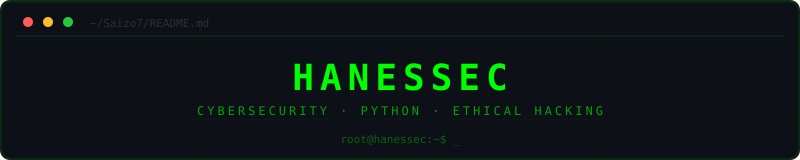

<div align="center">
  
</div>

<br>

<p align="center">
  
  
  
</p>

---

### `$ whoami`

Estudante de **Segurança da Informação** construindo base sólida em redes, ethical hacking e automação com Python. Formação prática via **Cisco NetAcad**. Acredito que entender o sistema por dentro é o primeiro passo para protegê-lo por fora.

---

### `$ ls stack/`

<p align="left">
  
  
  
  
  
</p>

---

### `$ cat roadmap_2026.txt`

```
[WIP] Cisco CyberOps Associate ........... em preparação
[Q2]  Ethical Hacking - NetAcad .......... labs documentados  
[Q3]  Ferramentas de rede em Python ....... portfólio público
[Q4]  Graduação .......................... portfólio de auditorias
```

---

<p align="center">
  
</p>

---

<p align="center"><sub>root@hanessec:~$ always learning, never stopping_</sub></p>
